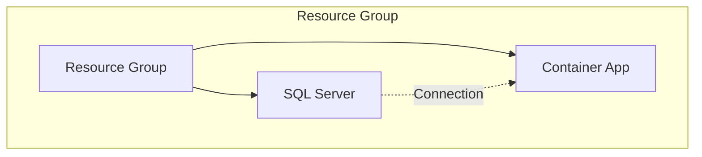
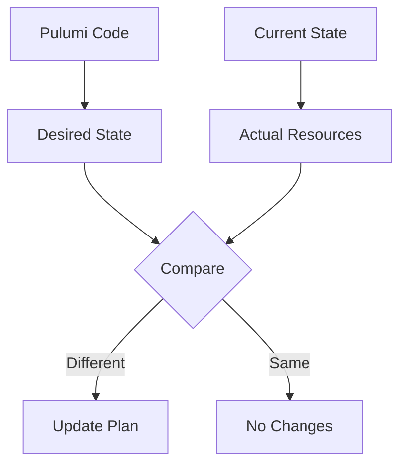
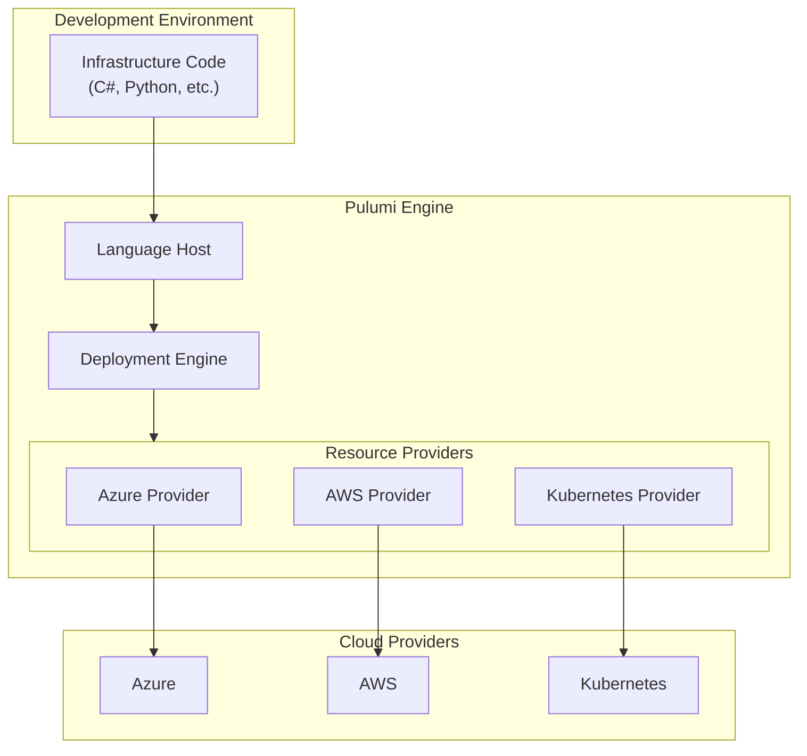
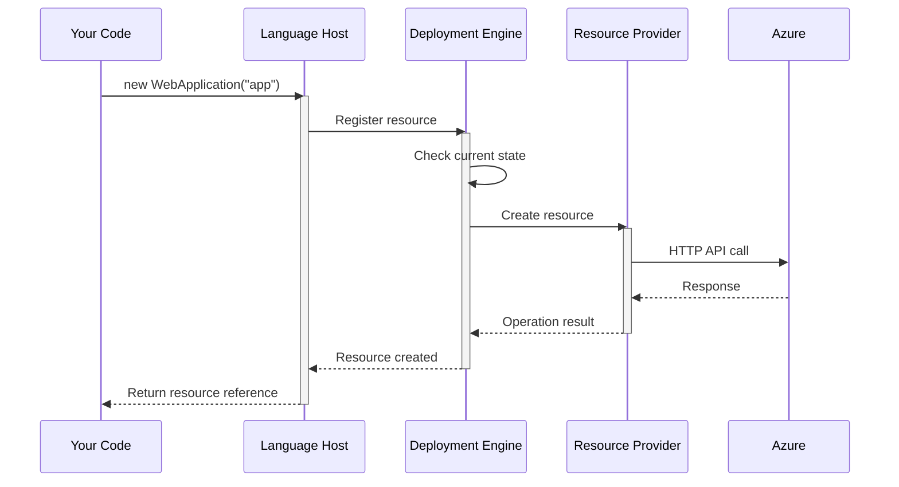

# Pulumi

<div class="opacity-80 italic mb-4">
Using real code to manage infrastructure
</div>

---
layout: default
hideInToc: true
---

# What Makes Pulumi Different

## Specialized Domain Specific Language (DSL)
```hcl
# Terraform HCL
resource "azurerm_container_app" "example" {
  name                = "example-app"
  resource_group_name = azurerm_resource_group.example.name
}
```

## Real Programming Language
```csharp
// C# with Pulumi
var app = new ContainerApp("example-app", new ContainerAppArgs
{
    ResourceGroupName = resourceGroup.Name
});
```

<!--
# Speaker Notes

Setup:
- Compare approaches side by side
- Both define same resources
- Different developer experience

Key Points:
- Real languages vs DSL
- Full IDE support
- Type safety included

Questions/Engagement:
- "Which feels more natural?"
- "What advantages do you see?"

Next:
- See real-world example
-->

---
layout: center
hideInToc: true
---

# Real-World Example: Container App

```hcl
resource "azurerm_container_app" "example" {
  name                         = "example-app"
  resource_group_name         = azurerm_resource_group.example.name
  container_app_environment_id = azurerm_container_app_environment.example.id
  revision_mode               = "Single"
  
  template {
    container {
      name   = "examplecontainerapp"
      image  = "mcr.microsoft.com/k8se/quickstart:latest"
      cpu    = 0.25
      memory = "0.5Gi"
    }
  }
}
```

<!--
# Speaker Notes

Setup:
- Common real-world scenario
- Multiple configuration levels
- Resource dependencies

Key Points:
- Configuration complexity
- Resource relationships
- Default handling
- Explain the basic Azure resources

Questions/Engagement:
- "What might be hard to maintain?"
- "How would you handle changes?"

Next:
- See same in Pulumi
-->

---
layout: center
hideInToc: true
---

# Same Resource in Pulumi

```csharp {all|13|all}
// Define container app with strongly-typed configuration
var app = new ContainerApp("example-app", new ContainerAppArgs
{
    ResourceGroupName = resourceGroup.Name,
    ManagedEnvironmentId = environment.Id,
    Template = new TemplateArgs
    {
        Containers = {
            new ContainerArgs
            {
                Name = "examplecontainer",
                Image = "mcr.microsoft.com/k8se/quickstart:latest",
                Resources = ContainerResources.GetResources(cpuCount: 0.25, gibibytesOfMemory: 0.5)
            }
        }
    }
});
```

<!--
# Speaker Notes

Setup:
- Same outcome, different approach
- Familiar C# patterns
- Strong typing benefits

Key Points:
- Type safety prevents errors
- IDE support helps
- Helper methods available

Questions/Engagement:
- "What C# features help here?"
- "How would you refactor this?"

Next:
- Build on this pattern
-->

---
layout: two-cols-header
hideInToc: true
---

# Building Abstractions

Turning infrastructure code into reusable components

::left::

## Raw Pulumi
```csharp
// Basic database setup
var database = new Database("demo-db", new DatabaseArgs
{
    ResourceGroupName = resourceGroup.Name,
    ServerName = sqlServer.Name,
    Sku = new SkuArgs
    {
        Name = config.Get("database-sku")
    }
});
```

::right::

## High-level SDK
```csharp
// High-level patterns
var database = new SqlDatabase("demo")
    .InResourceGroup(resourceGroup)
    .WithBasicTier();
```

<!--
# Speaker Notes

Setup:
- Evolution of infrastructure code
- Building team patterns
- Reducing complexity

Key Points:
- Raw: Full control
- High-level: Best practices
- Both have their place

Questions/Engagement:
- "Where would each fit?"
- "What would you abstract?"

Next:
- Core concepts overview
-->

---
layout: two-cols-header
hideInToc: true
---

# Core Concepts
Building blocks of Pulumi infrastructure

::left::

<div class="space-y-4">
  <div v-click class="concept-box">
    <div class="text-xl mb-2">📦 Projects</div>
    <ul class="text-sm">
      <li>Single unit of infrastructure</li>
      <li>Defines resources and patterns</li>
      <li>Version controlled together</li>
    </ul>
  </div>
</div>

::right::

<div class="space-y-4">
  <div v-click class="concept-box">
    <div class="text-xl mb-2">🏗️ Stacks</div>
    <ul class="text-sm">
      <li>Environment instances</li>
      <li>Configuration values</li>
      <li>Independent state</li>
    </ul>
  </div>
</div>

<style>
.concept-box {
  @apply p-4 rounded bg-gray-100 bg-opacity-10;
}
</style>

<!--
# Speaker Notes

Setup:
- Building blocks of Pulumi
- Each serves specific purpose
- Work together naturally

Key Points:
- Projects organize code
- Resources are cloud components
- Stacks separate environments
- State tracks everything

Questions/Engagement:
- "Similar to your project structure?"
- "Which concept is new?"

Next:
- See these in practice
-->

---
layout: two-cols-header
hideInToc: true
---

# Core Concepts #2

Examples of how Pulumi organizes infrastructure code

::left::

## Project
```yaml
# Pulumi.yaml
name: container-app
runtime: dotnet
description: Base container app template
```

::right::

## Stacks
```yaml 
# Pulumi.dev.yaml
config:
  name: myapp-dev
  size: small
  location: westeurope
  resourceGroup: dev-rg
```
```yaml
# Pulumi.prod.yaml
config:
  name: myapp-prod
  size: large
  location: northeurope
  resourceGroup: prod-rg
```

<!--
# Speaker Notes

Key points to emphasize:
- Project = Template
  * One implementation
  * Shared across environments
  * Define patterns once
  * Version controlled together

- Stacks = Configurations
  * Environment-specific values
  * Different sizing/scaling
  * Regional settings
  * Resource naming

Questions to ask:
- "How is this similar to your application configs?"
- "What kind of values would you put in stack config?"
- "How might this help with environment consistency?"
-->
---
layout: default
hideInToc: true
---

# Projects and Stacks in Practice

## Project Code (Implementation)
```csharp {all|13|all}
public class MyStack : Stack
{
    // Constructor is the point of entry
    public MyStack()
    {
        // Get stack-specific values
        var config = new Config();
        var location = AzureLocation.FromId(config.Require("location"));
        var resourceGroup = AzureResourceGroup.Create($"mews-pulumi-example-{location.Abbreviation}-tmp", location);

        // Create resources
        var containerAppEnvironment = AzureContainerAppEnvironment.Create(
            name: $"pulumi-example-cae--{location.Abbreviation}",
            location: location,
            resourceGroup: resourceGroup,
            logDestination: new AzureMonitorDestination()
        );
    }
}
```
<!--
# Speaker Notes

Setup:
- Moving from concepts to code
- Constructor entry point
- Configuration handling

Key Points:
- Stack structure drives code
- Configuration management
- Resource organization

Questions/Engagement:
- "Where would you use stacks?"
- "What would you put in config vs code?"

Next:
- Look at stack operations
-->

---
layout: two-cols-header
hideInToc: true
---

# Understanding Resources
Core building blocks of cloud infrastructure

::left::

<v-click>

## Key Concepts
<div class="concept-list">
  <div class="concept-item">
    <div class="icon">📦</div>
    <div class="text">Individual cloud components</div>
  </div>
  <div class="concept-item">
    <div class="icon">🔄</div>
    <div class="text">Automatic dependency tracking</div>
  </div>
  <div class="concept-item">
    <div class="icon">⚙️</div>
    <div class="text">Lifecycle management</div>
  </div>
</div>

</v-click>



::right::

<div class="ml-4">


<v-click>

## Implementation
```csharp
// Resource Definition
var resourceGroup = new ResourceGroup("rg-demo");

// Implicit Dependencies
var server = new SqlServer("sql-demo", new SqlServerArgs { 
    ResourceGroupName = resourceGroup.Name 
});

// Explicit Dependencies
var app = new ContainerApp("app-demo", 
    new ContainerAppArgs { ... }, 
    new CustomResourceOptions { 
        DependsOn = { server } 
    });
```

</v-click>

</div>

<style>
.concept-list {
  @apply space-y-2 my-2;
}

.concept-item {
  @apply flex text-xl p-2 rounded bg-gray-100 bg-opacity-10;
}
</style>

<!--
# Speaker Notes

Key points to emphasize:
1. Resources are fundamental units of cloud infrastructure
2. Dependencies can be implicit (resource hierarchy) or explicit
3. Pulumi automatically tracks and manages dependencies
4. The dependency graph determines deployment order
5. Show how code reflects the visual diagram structure

Interaction suggestions:
- Ask audience to identify dependencies in the diagram
- Point out how the code maps to visual relationships
- Discuss when to use explicit vs implicit dependencies
-->
---
layout: two-cols-header
hideInToc: true
---

# State Management
How Pulumi tracks and manages your infrastructure

::left::

<div class="core-concepts space-y-2 pr-2">
  <v-click>
    <div class="concept-card">
      <div class="title">
        <div class="icon">📝</div>
        <div class="text">Resource Tracking</div>
      </div>
      <div class="description">
        Maintains detailed record of all deployed resources and their properties
      </div>
    </div>
  </v-click>

  <v-click>
    <div class="concept-card">
      <div class="title">
        <div class="icon">🔄</div>
        <div class="text">Change Detection</div>
      </div>
      <div class="description">
        Compares desired state with current state to determine required changes
      </div>
    </div>
  </v-click>

  <v-click>
    <div class="concept-card">
      <div class="title">
        <div class="icon">🔒</div>
        <div class="text">State Locking</div>
      </div>
      <div class="description">
        Prevents concurrent modifications to avoid conflicts
      </div>
    </div>
  </v-click>

  <v-click>
    <div class="concept-card">
      <div class="title">
        <div class="icon">🤝</div>
        <div class="text">Team Synchronization</div>
      </div>
      <div class="description">
        Enables collaboration through shared state backend
      </div>
    </div>
  </v-click>
</div>

::right::

## State & Reality



<style>
.concept-card {
  @apply bg-gray-100 bg-opacity-10 p-2 rounded-lg transition-all;
}

.concept-card .title {
  @apply flex items-center space-x-1 mb-1;
}

.concept-card .icon {
  @apply text-1xl;
}

.concept-card .text {
  @apply font-semibold;
}
</style>

<!--
# Speaker Notes

Key points to emphasize:
1. State is the source of truth
2. Regular refresh keeps state accurate
3. Preview shows planned changes
4. State locking prevents conflicts
5. Team collaboration through shared state

Flow explanation:
- Code defines desired state
- Current state tracks deployed resources
- Compare differences to create plan
- Apply changes when needed
- Refresh syncs state with reality

Tips:
- Demonstrate refresh workflow
- Show common state drift scenarios
- Discuss team collaboration practices
-->

---
layout: two-cols-header
hideInToc: true
---

# How Pulumi Works
Understanding the orchestration of infrastructure changes

::left::



::right::

<div class="mt-4 space-y-4">
  <div v-click class="component-box">
    <div class="text-xl mb-2">Language Host</div>
    <div class="text-sm opacity-75">Executes your C# code and tracks resource declarations</div>
  </div>

  <div v-click class="component-box">
    <div class="text-xl mb-2">Deployment Engine</div>
    <div class="text-sm opacity-75">Orchestrates changes and manages state</div>
  </div>

  <div v-click class="component-box">
    <div class="text-xl mb-2">Resource Providers</div>
    <div class="text-sm opacity-75">Connect to cloud APIs and handle operations</div>
  </div>
</div>

<style>
.component-box {
  @apply p-4 rounded bg-gray-100 bg-opacity-10;
}
</style>

<!--
# Speaker Notes

Component Roles:

1. Language Host
   - Executes your C# code
   - Manages program runtime
   - Interprets resource declarations
   - Communicates with deployment engine

2. Deployment Engine
   - Heart of Pulumi
   - Compares desired vs current state
   - Orchestrates resource operations
   - Manages dependencies
   - Handles rollbacks

3. Resource Providers
   - Bridge to cloud APIs
   - Handle CRUD operations
   - Validate resource configurations
   - Report operation status

Flow explanation:
1. Your code runs in Language Host
2. Resource declarations sent to Deployment Engine
3. Engine determines required changes
4. Providers execute actual cloud operations

Key benefits:
- Separation of concerns
- Cloud-agnostic core
- Extensible provider model
- Native language experience

Questions to ask:
- "Where would you add new cloud support?"
- "What happens if a provider operation fails?"
-->
---
layout: center
hideInToc: true
---

# Architecture in Action



<!--
# Speaker Notes

Execution flow:
1. Code Declaration
   - Your C# code runs normally
   - Resource constructors create declarations
   - No cloud operations yet

2. Resource Registration
   - Language host tracks resources
   - Builds dependency graph
   - Sends to deployment engine

3. State Comparison
   - Engine checks existing state
   - Determines required changes
   - Plans operations

4. Provider Operations
   - Provider executes changes
   - Reports progress
   - Handles errors
   - Updates state

Key points:
- Async operations
- Error handling at each level
- State updates
- Progress reporting

Questions to ask:
- "Where could errors occur?"
- "How would rollback work?"
- "What happens if remote call fails?"

Next:
- Let's see real implementation
-->

---
layout: center
hideInToc: true
---

# Quick Questions

<div class="text-xl space-y-8">
  <div v-click class="question">
    What if I already created some resources manually?
  </div>

  <div v-click class="question">
    What if I lose my state storage?
  </div>

  <div v-click class="question">
    What if somebody changes resource manually?
  </div>
</div>

<style>
.question {
  @apply p-4 rounded bg-blue-500 bg-opacity-10 cursor-pointer hover:bg-opacity-20 transition-all;
}
</style>